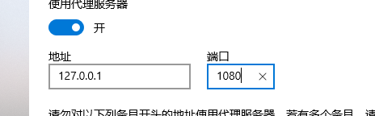
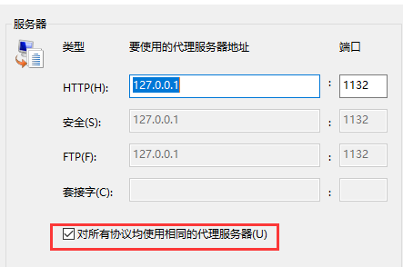
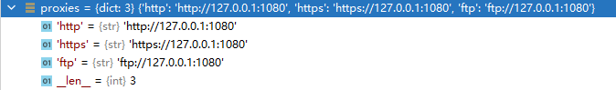
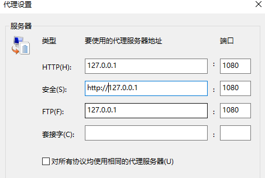
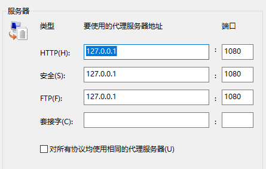
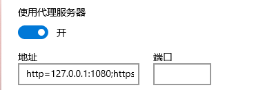
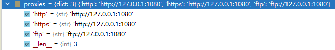
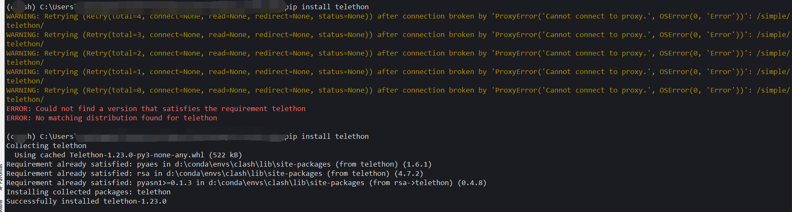

#### 问题

在pip install的时候出现此种错误
```sh
WARNING: Retrying (Retry(total=4, connect=None, read=None, redirect=None, status=None)) after connection broken by 'ProxyError('Cannot connect to proxy.', OSError(0, 'Error'))': /simple/numpy/
WARNING: Retrying (Retry(total=3, connect=None, read=None, redirect=None, status=None)) after connection broken by 'ProxyError('Cannot connect to proxy.', OSError(0, 'Error'))': /simple/numpy/
WARNING: Retrying (Retry(total=2, connect=None, read=None, redirect=None, status=None)) after connection broken by 'ProxyError('Cannot connect to proxy.', OSError(0, 'Error'))': /simple/numpy/
WARNING: Retrying (Retry(total=1, connect=None, read=None, redirect=None, status=None)) after connection broken by 'ProxyError('Cannot connect to proxy.', OSError(0, 'Error'))': /simple/numpy/
```

#### 原因

在windows平台中的代理设置, 可以在IE的`Internet选项`中设置, 或者在`设置`中的`网络和Internet.代理`中设置. 一般情况下, 都是如图所示




注意红框中的部分, 这就会导致, `urllib`中获取系统代理的代码
```python
def getproxies_registry():
        """Return a dictionary of scheme -> proxy server URL mappings.

        Win32 uses the registry to store proxies.

        """
        proxies = {}
        try:
            import winreg
        except ImportError:
            # Std module, so should be around - but you never know!
            return proxies
        try:
            internetSettings = winreg.OpenKey(winreg.HKEY_CURRENT_USER,
                r'Software\Microsoft\Windows\CurrentVersion\Internet Settings')
            proxyEnable = winreg.QueryValueEx(internetSettings,
                                               'ProxyEnable')[0]
            if proxyEnable:
                # Returned as Unicode but problems if not converted to ASCII
                proxyServer = str(winreg.QueryValueEx(internetSettings,
                                                       'ProxyServer')[0])
                if '=' in proxyServer:
                    # Per-protocol settings
                    for p in proxyServer.split(';'):
                        protocol, address = p.split('=', 1)
                        # See if address has a type:// prefix
                        if not re.match('(?:[^/:]+)://', address):
                            address = '%s://%s' % (protocol, address)
                        proxies[protocol] = address
                else:
                    # Use one setting for all protocols
                    if proxyServer[:5] == 'http:':
                        proxies['http'] = proxyServer
                    else: 
                        # 执行的是此处, 符合windows中的逻辑'对所有协议均使用相同的代理服务器'
                        # 但是显然, 我们本地的代理服务器不会支持'https'类型的代理
                        # 就直接导致了问题的出现
                        proxies['http'] = 'http://%s' % proxyServer
                        proxies['https'] = 'https://%s' % proxyServer
                        proxies['ftp'] = 'ftp://%s' % proxyServer
            internetSettings.Close()
        except (OSError, ValueError, TypeError):
            # Either registry key not found etc, or the value in an
            # unexpected format.
            # proxies already set up to be empty so nothing to do
            pass
        return proxies
```

此种情况下, `urllib`获得的系统代理



`https:/127.0.0.1:1080`, 显然是我们本地不支持https代理
我们需要让代码走上面的if
```python
if '=' in proxyServer:
    # Per-protocol settings
    for p in proxyServer.split(';'):
        protocol, address = p.split('=', 1)
        # See if address has a type:// prefix
        if not re.match('(?:[^/:]+)://', address):
            # 并且不能让它走到这步里面, 要在代理里面指定https = http://127.0.0.1:1080
            # 而非 https = 127.0.0.1:1080
            address = '%s://%s' % (protocol, address)
        proxies[protocol] = address
```

那么我们在`Internet选项`中配置



但是在我们点击确定后, 在回来查看时



可以看到`安全(S)`(即https代理)前面没有了`http://`
但是在`设置.网络和Internet.代理`选项中我们可以看到


复制出来
```sh
http=127.0.0.1:1080;https=http://127.0.0.1:1080;ftp=127.0.0.1:1080
```

可以看到python的代码其实是从注册表中获取代理配置的, 也去注册表里面验证一下


也是我们想要的配置
再运行下, 看看`proxies`是不是我们期望的proxy



现在再运行`pip install XXXX`则没有问题了



#### 简单方法

直接用python修改注册表
```python
import winreg

def set_reg():
    key = winreg.OpenKey(winreg.HKEY_CURRENT_USER, r'Software\Microsoft\Windows\CurrentVersion\Internet Settings', 0,
                         winreg.KEY_WRITE)
    winreg.SetValueEx(key, 'ProxyServer', 0, winreg.REG_SZ,
                      "http=127.0.0.1:1080;https=http://127.0.0.1:1080;ftp=127.0.0.1:1080")
```
